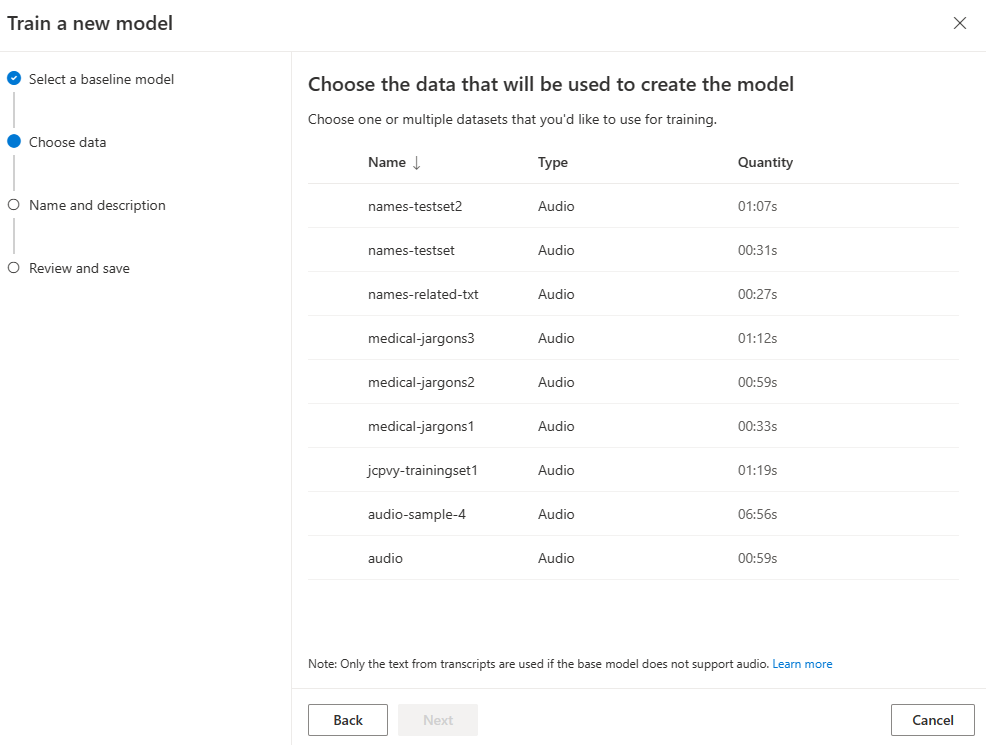

# Speech Transcription with Custom Speech Model 

This repo has utility to submit a batch transcription job to transcribe an audio file which contains domain specific keywords. 
The custom speech model has been trained with a couple of audio files and a single pronounciation file to improve the accuracy in detecting domain specific words. 

## Prerequisites

    - Azure Speech Service provisioned with subscription key and region information

    - A sample audio file with domain specific words and a pronounciation file - available in the data/training-set folder

    - Custom Speech Model trained using the training dataset using Azure Speech studio 

## To execute the transcription job

The custom speech model is trained using two audio files and a single pronounciation file all combined in a single zip folder. This zip folder is then uploaded to the speech data set in speech studio. 

Create a custom speech model, by creating a new training job in speech studio and pointing it to the training-set which has both audio files and pronounication file. 

Once the model is trained, the model id is retrived that is required for the transcription job.

Provide the speech service subscription key, region and url to the audio file that needs to the tested. A sample audio file is provided in the data/testset folder.

        // Replace with your subscription key
        public const string SubscriptionKey = "";

        // Update with your service region
        public const string Region = "";

        private static Uri RecordingsBlobUri = new Uri("Blob URL to test audio file with SAS token");

To use base model to transcribe, set CustomModel to null

        private static EntityReference CustomModel = null
        
To use custom model provide model id 

        //replace the model id retrieved from above step
        private static EntityReference CustomModel =
          new EntityReference { Self = new Uri($"https://{Region}.api.cognitive.microsoft.com/speechtotext/v3.1/models/<model id>")};

The transcription job can be submitted by providing the required information in program.cs file and running the project using dotnet run from cli.

From CLI

    cd \batchclient
    dotnet run 

This creates a transcription and outputs it to the cli window. 

* Note: This repo is forked from the main repo https://github.com/anildwarepo/cognitive-services-speech-sdk

